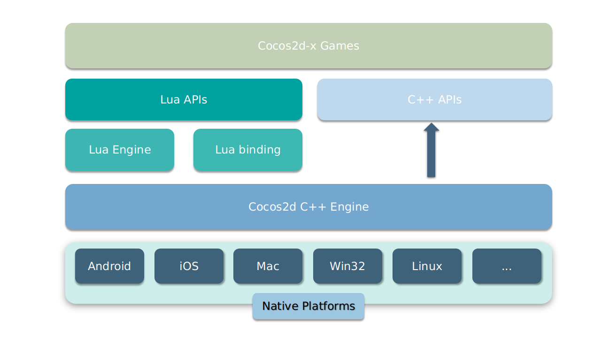

cocos2d-x
=========

|Win32|Others|
| ----|------|
[](https://ci.appveyor.com/project/minggo/cocos2d-x/branch/v4)|[](https://travis-ci.org/cocos2d/cocos2d-x)


[cocos2d-x][1] is a multi-platform framework for building 2d games, interactive books, demos and other graphical applications.
It is based on __cocos2d-iphone__, but instead of using Objective-C, it uses C++.
It works on iOS, Android, macOS, Windows and Linux.

**Cocos2d-x Framework Architecture**:



cocos2d-x is:

  * Fast
  * Free
  * Easy to use
  * Community supported

Git user attention
-----------------------

1. Clone the repo from GitHub.

         $ git clone https://github.com/cocos2d/cocos2d-x.git

2. After cloning the repo, please execute `download-deps.py` to download and install dependencies.

         $ cd cocos2d-x
         cocos2d-x $ python download-deps.py

3. After running `download-deps.py`.

         cocos2d-x $ git submodule update --init

Download stable versions
-----------------------

* [Cocos2d-x stable versions](https://cocos2d-x.org/download)

Documentations and samples
-------------
* [All Docs in a single place!](http://docs.cocos2d-x.org/)
* [Online API Reference](http://docs.cocos2d-x.org/api-ref/index.html) _Note that Cocos2d-x and Cocos Creator have different API set_
* [Programmers Guide](https://docs.cocos2d-x.org/cocos2d-x/v4/en/basic_concepts/)
* [Latest Release Note](https://github.com/cocos2d/cocos2d-x/blob/v4/docs/RELEASE_NOTES.md)
* [Changelog](https://github.com/cocos2d/cocos2d-x/blob/v4/CHANGELOG)

Main features
-------------
   * Scene management (workflow)
   * Transitions between scenes
   * Sprites and Sprite Sheets
   * Effects: Lens, Ripple, Waves, Liquid, etc.
   * Actions (behaviours):
     * Transformation Actions: Move, Rotate, Scale, Fade, Tint, etc.
     * Composable actions: Sequence, Spawn, Repeat, Reverse
     * Ease Actions: Exp, Sin, Cubic, Elastic, etc.
     * Misc actions: CallFunc, OrbitCamera, Follow, Tween
   * Basic menus and buttons
   * Integrated with physics engines: [Box2d][5] and [Chipmunk][6]
   * Particle system
   * Skeleton Animations: [Spine][7] and Armature support
   * Fonts:
     * Fast font rendering using Fixed and Variable width fonts
     * Support for .ttf fonts
   * Tile Map support: Orthogonal, Isometric and Hexagonal
   * Parallax scrolling
   * Motion Streak
   * Render To Texture
   * Touch/Accelerometer on mobile devices
   * Touch/Mouse/Keyboard on desktop
   * Sound Engine support
   * Integrated Slow motion/Fast forward
   * Fast and compressed textures: PVR compressed and uncompressed textures, ETC1 compressed textures, and more
   * Resolution Independent
   * Language: C++, with Lua and JavaScript bindings
   * Open Source Commercial Friendly(MIT): Compatible with open and closed source projects
   * OpenGL ES 2.0 (mobile) / OpenGL 2.1 (desktop) / metal(macos and iOS) based

Build Requirements
------------------

* Mac OS X 10.7+, Xcode 8+
* or Ubuntu 14.04+, CMake 3.1+
* or Windows 7+, VS 2015
* Python 2.7.5+(NOT Python 3)
* NDK r16+ is required to build Android games
* Android Studio 3.0.0+ to build Android games(tested with 3.0.0)
* JRE or JDK 1.6+ is required for web publishing

Runtime Requirements
--------------------
  * iOS 8.0+ for iPhone / iPad games
  * Android 3.0.0+ for Android
  * OS X v10.9+ for Mac games
  * Windows 7+ for Win games

Environment Setup
--------------------

Should set up environment before starting a new game or running tests

```
$ cd cocos2d-x
$ ./setup.py
$ source FILE_TO_SAVE_SYSTEM_VARIABLE

```

Should invoke this script if using linux system

```
$ cd cocos2d-x
$ ./install-linux-deps.sh
```

Running Tests
--------------------

```
$ cd cocos2d-x
$ mkdir build
$ cd build
$ cocos run --proj-dir .. -p [mac|win32|android|linux|ios]
```

How to start a new game
-----------------------

    $ cd cocos2d-x
    $ ./setup.py
    $ source FILE_TO_SAVE_SYSTEM_VARIABLE
    $ cocos new MyGame -p com.your_company.mygame -l cpp -d NEW_PROJECTS_DIR
    $ cd NEW_PROJECTS_DIR/MyGame
    $ mkdir build
    $ cd build
    $ cocos run --proj-dir .. -p [mac|win32|android|linux|ios]

You can also create a Lua project with `-l lua`.

Using IDE
----------------------------

If need to debug program, then it is more convinent to use IDE to run and debug it. All platforms other than Android can use CMake to generate corresponding project file. Can refer to [Detail CMake Guide](cmake/README.md) for detail information.

For Android, the Android Studio project file lies in `PROJECT_DIR/proj.android`. Can just use Android Studio to import the exsting project file.

Learning Resources
--------------------------------

* [Programmers Guide](https://docs.cocos2d-x.org/cocos2d-x/v4/en/basic_concepts/)
* [Android Fundamentals](https://developer.android.com/guide/components/fundamentals.html)
* [Games From Scratch](http://www.gamefromscratch.com/page/Cocos2d-x-CPP-Game-Programming-Tutorial-Series.aspx)
* [Make School Tutorials](https://github.com/MakeSchool?utf8=✓&q=cocos2d&type=&language=)

Spreading the word!
--------------------------------
You can help us spread the word about cocos2d-x! We would surely appreciate it!

* Twitter: [@CocosEngine](https://twitter.com/CocosEngine)
* Facebook: [https://www.facebook.com/CocosEngine](https://www.facebook.com/CocosEngine)
* YouTube: [https://www.youtube.com/cocosengine](https://www.youtube.com/cocosengine)
* Weibo: [@Cocos引擎](https://weibo.com/cocos2dx)
* bilibili: [https://space.bilibili.com/491120849](https://space.bilibili.com/491120849)

Where to get help
--------------------------------

* [English Forums][9]
* [中文社区][10]
* [Bug Tracker](https://github.com/cocos2d/cocos2d-x/issues)
* [API Reference](http://docs.cocos2d-x.org/api-ref/index.html).
* [Latest Release Note](https://github.com/cocos2d/cocos2d-x/blob/v4/docs/RELEASE_NOTES.md)
* [Changelog](https://github.com/cocos2d/cocos2d-x/blob/v4/CHANGELOG)
* [Discord Channel](https://discord.gg/pVqab4K)
* `cpp-tests` project. This project is our basis for testing. Use this project to
learn how we implement the functionality of the engine. This project is located in
__cocos2d-x_root/build.__

Contributing to the Project
--------------------------------

Cocos2d-x is licensed under the [MIT License](https://opensource.org/licenses/MIT). We welcome participation!

Did you find a bug? Do you have feature request? Do you want to merge a feature?

  * [contributing to cocos2d-x][8]

Embrace the Future: Switch to Cocos Creator for a Better Experience
--------------------------------
[Cocos Creator][12] is the new generation of Cocos game engine with a full featured editor and content creation friendly workflow. It supports all major platforms allowing games to be quickly released for the web, iOS, Android, Windows, Mac, and various mini-game platforms. Millions of developers have built 2D / 3D experiences, from hardcore games to web instant entertainment. A pure JavaScript-developed engine runtime is available on the web and mini-game platforms for better performance and smaller packages. On other native platforms, C++ is used to implement the underlying framework, providing greater operational efficiency. The engine is completely [open source][13], and retains the advantages of Cocos2d-x which includes high performance, customizability, ease for debugging, easy to learn, and small package size.

Therefore, we no longer recommend new users to start with Cocos2d-x. Instead, please use the brand-new [Cocos Creator][12] for project development to enjoy the best editor and 3D support.

[1]: https://www.cocos.com/en/cocos2d-x "cocos2d-x"
[4]: https://cocos2d-x.org/download/version#Cocos2d-x
[5]: http://www.box2d.org "Box2D"
[6]: http://www.chipmunk-physics.net "Chipmunk2D"
[7]: http://esotericsoftware.com/ "http://esotericsoftware.com/"
[8]: https://github.com/cocos2d/cocos2d-x/blob/v3/CONTRIBUTING.md
[9]: https://discuss.cocos2d-x.org/c/cocos2d-x/21
[10]: https://forum.cocos.org/c/cocos2d-x/16
[12]: https://www.cocos.com/en/creator
[13]: https://github.com/cocos/cocos-engine
