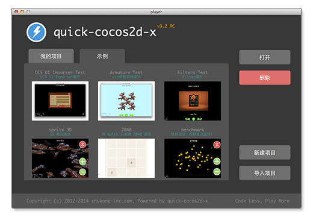

quick-cocos2d-x v3
==================

quick-cocos2d-x v3 是在 cocos2dx 3.x 的最新版本基础之上，移植了原来 quick-cocos2d-x 的核心框架、强大的 player 、丰富的示例等，并增加更多新的功能。

> 当前版本为 V3.3

## 使用指南

### 下载与安装

-   安装包（含源代码）
    
    安装包可以快速完成一些基本设置，并包含编译好的 player 执行文件，简化了安装配置步骤。只需要下载 quick 安装包后，按照安装程序的提示进行操作即可。如果是 Mac 系统，建议先安装好 Xcode 开发工具。

    访问 [http://cn.cocos2d-x.org/](http://cn.cocos2d-x.org/) 下载安装包。

    安装过程很简单，基本上一路点“继续”或者“下一步”即可。在windows下安装你可以修改要安装的目录位置。另外，如果你以前安装过 quick 3.x 的其他版本，并且对引擎代码自己做过修改，请预先备份自己的工作，避免被新版本覆盖。
    
### 快速开始

quick-cocos2d-x 中带有一个名为 player 的工具。

这个工具不但是一个功能完善的模拟器，可以在 Mac/Windows 桌面运行开发者的游戏，还是一个功能齐备的开发工具入口。

开发者启动 player 后，将可以完成下列任务：

-   创建项目
-   打开项目
-   编译项目
-   查看示例

未来，我们还将增加更多功能。

现在就下载安装 quick，然后启动 player3.app 或 player3.exe 查看 quick 中那些精彩的示例程序吧。

### 使用指南

-    [player 使用说明](docs/howto/player-user-manual/zh.md)
-    [创建工程](docs/howto/create-project/zh.md)
-    [在 Code IDE 中调试 quick 工程](docs/howto/use-codeide/zh.md)
-    [用 CCSLoader 读取 Cocos Studio 输出的场景/UI 文件](docs/howto/use-ccsloader/zh.md)
-    [编译 Android 工程](docs/howto/compile-android/zh.md)
-    [升级到 quick-cocos2d-x 最新版](docs/howto/upgrade/zh.md)
-    [使用bindings-generator导出自定义C++类](docs/howto/use-bindings-generator/zh.md)
-    [对 Lua 字节码进行加密](docs/howto/encrypt-lua-code/zh.md)

### 参考手册

-    [quick 中的事件](docs/manual/events/zh.md)
-    [quick 中的触摸事件](docs/manual/touch-events/zh.md)
-    [API 文档](docs/api/index.html)

