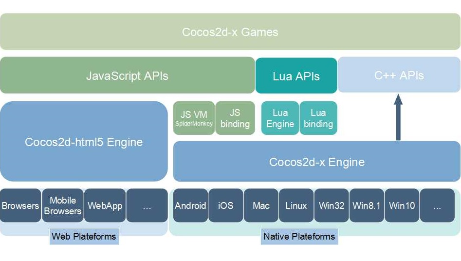

cocos2d-x
=========

|Win32|Others|
| ----|------|
[](https://ci.appveyor.com/project/minggo/cocos2d-x/branch/v3)|[](https://travis-ci.org/cocos2d/cocos2d-x)


[cocos2d-x][1] is a multi-platform framework for building 2d games, interactive books, demos and other graphical applications.
It is based on cocos2d-iphone, but instead of using Objective-C, it uses C++.
It works on iOS, Android, OS X, Windows, Linux and Web platforms.

**Cocos2d-x Framework Architecture**:



cocos2d-x is:

  * Fast
  * Free
  * Easy to use
  * Community supported

Git user attention
-----------------------

1. Clone the repo from GitHub.

         $ git clone https://github.com/cocos2d/cocos2d-x.git

2. After cloning the repo, please execute `download-deps.py` to download and install dependencies.

         $ cd cocos2d-x
         cocos2d-x $ python download-deps.py

3. After running `download-deps.py`.

         cocos2d-x $ git submodule update --init

Download stable versions
-----------------------

* [Cocos2d-x stable versions](http://www.cocos2d-x.org/download)

How to start a new game
-----------------------

1. Download the code from [cocos2d download site](http://www.cocos2d-x.org/download) or clone this repo (instructions above)
2. Run `setup.py`
3. Run the `cocos` script

Example:

    $ cd cocos2d-x
    $ ./setup.py
    $ source FILE_TO_SAVE_SYSTEM_VARIABLE
    $ cocos new MyGame -p com.your_company.mygame -l cpp -d NEW_PROJECTS_DIR
    $ cd NEW_PROJECTS_DIR/MyGame

You can also create a JS project or Lua project with `-l js` or `-l lua`.

### Build and run a new project for Android ###

Cocos2d-x supports Android Studio. Simple open the `proj.android` directory from within the Android Studio environment. More information can be found in our [documentation](https://docs.cocos2d-x.org/cocos2d-x/v3/en/installation/Android-Studio.html).
   
### Build and run a new project for iOS ###

    $ cocos run -p ios

### Build and run a new project for OSX ###

    $ cocos run -p mac

### Build and run a new project for Linux ###

If you never run cocos2d-x on Linux, you need to install all dependencies by the
script in **cocos2d/build/install-deps-linux.sh**

    $ cd cocos2d-x/build
    $ ./install-deps-linux.sh

Then

    $ cd NEW_PROJECTS_DIR/MyGame
    $ cocos run -p linux

Run

    $ bin/MyGame

### Build and run new project for win32 ###

    $ cocos run -p win32

### Build and run new project for web ###

Only JS project can be published to web platforms, so you will need to create a JS project first:

    $ cocos new -l js WebGame

Then you can run your game in a web browser:

    $ cocos run -p web

Or you can publish your game to `publish/html5/` folder:

    $ cocos run -p web -m release [--advanced]

Using CMake
--------------------------------

Cocos2d-x supports CMake, a cross-platform build system. Example usage:

    $ cd cocos2d-x
    $ mkdir cmake-build && cd cmake-build
    $ cmake ..

* [Detail CMake Guide](cmake/README.md)

Documentations and samples
-------------
* [All Docs in a single place!](http://cocos2d-x.org/docs/)
* [Online API Reference](http://cocos2d-x.org/docs/api-ref/index.html) _Note that Cocos2d-x, Cocos2d-JS and Cocos Creator have different API set_
* [Programmers Guide](https://docs.cocos2d-x.org/cocos2d-x/v3/en/basic_concepts/)
* [Latest Release Note](https://github.com/cocos2d/cocos2d-x/blob/v3/docs/RELEASE_NOTES.md)
* [Changelog](https://github.com/cocos2d/cocos2d-x/blob/v3/CHANGELOG)

Main features
-------------
   * Scene management (workflow)
   * Transitions between scenes
   * Sprites and Sprite Sheets
   * Effects: Lens, Ripple, Waves, Liquid, etc.
   * Actions (behaviours):
     * Transformation Actions: Move, Rotate, Scale, Fade, Tint, etc.
     * Composable actions: Sequence, Spawn, Repeat, Reverse
     * Ease Actions: Exp, Sin, Cubic, Elastic, etc.
     * Misc actions: CallFunc, OrbitCamera, Follow, Tween
   * Basic menus and buttons
   * Integrated with physics engines: [Box2d][5] and [Chipmunk][6]
   * Particle system
   * Skeleton Animations: [Spine][7] and Armature support
   * Fonts:
     * Fast font rendering using Fixed and Variable width fonts
     * Support for .ttf fonts
   * Tile Map support: Orthogonal, Isometric and Hexagonal
   * Parallax scrolling
   * Motion Streak
   * Render To Texture
   * Touch/Accelerometer on mobile devices
   * Touch/Mouse/Keyboard on desktop
   * Sound Engine support (CocosDenshion library) based on OpenAL
   * Integrated Slow motion/Fast forward
   * Fast and compressed textures: PVR compressed and uncompressed textures, ETC1 compressed textures, and more
   * Resolution Independent
   * Language: C++, with Lua and JavaScript bindings
   * Open Source Commercial Friendly(MIT): Compatible with open and closed source projects
   * OpenGL ES 2.0 (mobile) / OpenGL 2.1 (desktop) based

Build Requirements
------------------

* Mac OS X 10.7+, Xcode 8+
* or Ubuntu 14.04+, CMake 3.1+
* or Windows 7+, VS 2015
* Python 2.7.5+ (NOT Python 3)
* NDK r16+ is required to build Android games
* Android Studio 3.0.0+ to build Android games(tested with 3.0.0)
* JRE or JDK 1.6+ is required for web publishing

Runtime Requirements
--------------------
  * iOS 8.0+ for iPhone / iPad games
  * Android 3.0.0+ for Android
  * OS X v10.9+ for Mac games
  * Windows 7+ for Win games
  * Modern browsers and IE 9+ for web games

Running Tests
--------------------

Select the test you want from Xcode Scheme chooser.

* Cocos Console

```
// Enter cpp test folder
cd tests/cpp-tests
// Or enter js test folder
cd tests/js-tests
// Or enter lua test folder
cd tests/lua-tests

// Compile or run test case
cocos compile -p ios|mac|android|win32|win8_1|metro|web -m debug|release
cocos run -p ios|mac|android|win32|win8_1|metro|web -m debug|release
```

* For OS X / iOS

```
$ cd cocos2d-x/build
$ open cocos2d_tests.xcodeproj
```

* For Linux

```
$ cd cocos2d-x/build
$ ./install-deps-linux.sh
$ mkdir linux-build
$ cd linux-build
$ cmake ../..
```

Run Samples

```
$ bin/Debug/cpp-empty-test/cpp-empty-test
or
$ bin/Debug/lua-empty-test/lua-empty-test
```

> You may meet building errors when building libGLFW.so. It is because libGL.so directs to an error target, you should make it to direct to a correct one. `install-deps-linux.sh` only has to be run once.

* For Windows

Open the `cocos2d-x/build/cocos2d-win32.sln`

* For Android

```
$ cd cocos2d-x/build
$ python ./android-build.py cpp-empty-test -p 14
$ adb install ../tests/cpp-empty-test/proj.android/bin/CppEmptyTest-debug.apk
```

Then click item on Android device to run tests. Available value of `-p` is the API level, cocos2d-x supports from level 14.

Or you can import the project located at `tests/cpp-empty-test/proj.android` using Android Studio 3.0.0+.

Learning Resources
--------------------------------

* [Programmers Guide](https://docs.cocos2d-x.org/cocos2d-x/v3/en/basic_concepts/)
* [Android Fundamentals](https://developer.android.com/guide/components/fundamentals.html)
* [Make School Tutorials](https://www.makeschool.com/tutorials/)
* [Games From Scratch](http://www.gamefromscratch.com/page/Cocos2d-x-CPP-Game-Programming-Tutorial-Series.aspx)
* [Cocos2d sample games](https://github.com/cocos2d/cocos2d-x-samples)

Spreading the word!
--------------------------------
You can help us spread the word about cocos2d-x! We would surely appreciate it!

* Talk about us on Facebook! Our [Facebook Page](https://www.facebook.com/cocos2dx/)
* Tweet, Tweet! Our [Twitter](https://twitter.com/cocos2dx)
* Read our [Blog](http://blog.cocos2d-x.org/) and promote it on your social media.

Where to get help
--------------------------------

* [English Forums](http://discuss.cocos2d-x.org)
* [中文社区](http://forum.cocos.com/c/cocos2d-x)
* [Bug Tracker](https://github.com/cocos2d/cocos2d-x/issues)
* [API Reference](http://cocos2d-x.org/docs/api-ref/index.html).
* [Latest Release Note](https://github.com/cocos2d/cocos2d-x/blob/v3/docs/RELEASE_NOTES.md)
* [Changelog](https://github.com/cocos2d/cocos2d-x/blob/v3/CHANGELOG)
* IRC. We are in [Freenode](https://webchat.freenode.net/) in the _#cocos2d_ channel
* `cpp-tests` project. This project is our basis for testing. Use this project to
learn how we implement the functionality of the engine. This project is located in
__cocos2d-x_root/build.__

Contributing to the Project
--------------------------------

Cocos2d-x is licensed under the [MIT License](https://opensource.org/licenses/MIT). We welcome participation!

Did you find a bug? Do you have feature request? Do you want to merge a feature?

  * [contributing to cocos2d-x][8]

Contact us
----------

   * Forum: [http://discuss.cocos2d-x.org][9]
   * Twitter: [http://www.twitter.com/cocos2dx][10]
   * Weibo: [http://t.sina.com.cn/cocos2dx][11]

[1]: http://www.cocos2d-x.org "cocos2d-x"
[5]: http://www.box2d.org "Box2D"
[6]: http://www.chipmunk-physics.net "Chipmunk2D"
[7]: http://esotericsoftware.com/ "http://esotericsoftware.com/"
[8]: https://github.com/cocos2d/cocos2d-x/blob/v3/CONTRIBUTING.md
[9]: http://discuss.cocos2d-x.org "http://discuss.cocos2d-x.org"
[10]: http://www.twitter.com/cocos2dx "http://www.twitter.com/cocos2dx"
[11]: http://t.sina.com.cn/cocos2dx "http://t.sina.com.cn/cocos2dx"
