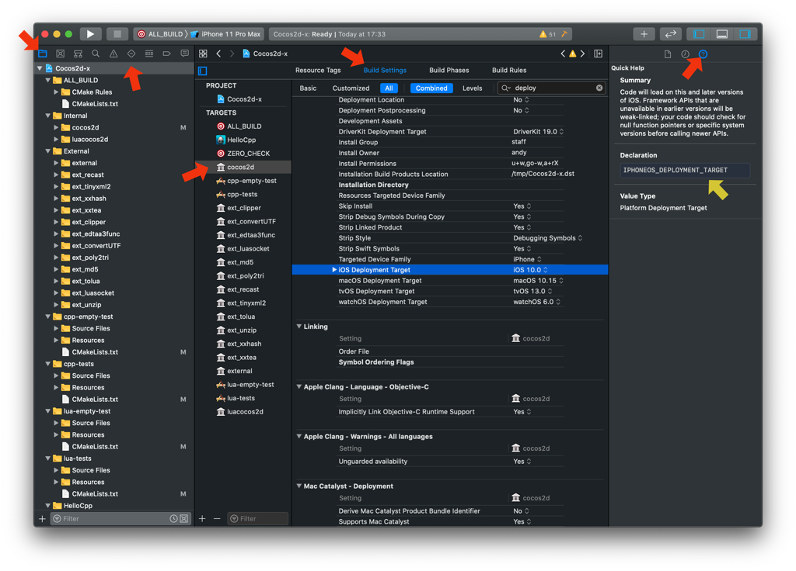
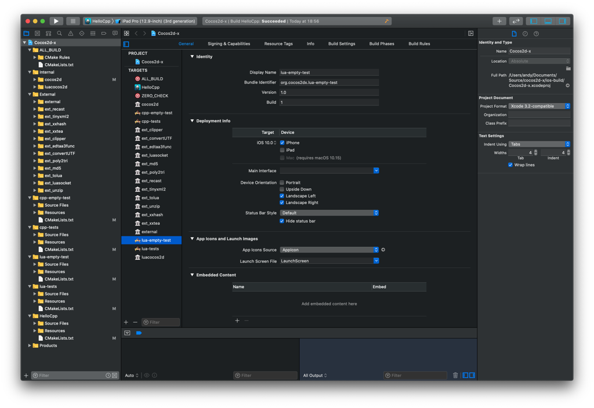

# CMake Guide

CMake is an open-source, cross-platform family of tools designed to build, test and package software. CMake is used to control the software compilation process using simple platform and compiler independent configuration files, and generates native makefiles and workspaces that can be used in the compiler environment of your choice.

## Requirement

1. Open your terminal and execute:
  ```sh
  cmake --version
  ```
if the CMake version is lower than 3.6, please upgrade.

2. You should use __out-of-source__ builds, this means you need to create a different directory than __cocos2d-x__ to execute the `cmake` command.

## Step by Step

### Linux

```sh
cd cocos2d-x
mkdir linux-build && cd linux-build
cmake ..
make
``` 

Execute `make help` to see all build targets, `make <target>` build specified target

### Generate Visual Studio projects

```sh
cd cocos2d-x
mkdir win32-build && cd win32-build
cmake .. -G"Visual Studio 15 2017" -Tv141
```

Execute `cmake --build .` to compile,
```
cmake --build . --config Debug
cmake --build . --config Release
```
or open __Cocos2d-x.sln__ in Explorer to use the generated project. 

If can't found `MSVCR110.dll` issue occurs to you, please install this [Visual C++ Runtime Libraries](https://www.microsoft.com/en-us/download/details.aspx?id=30679), when runing the cpp-tests project

### Generate macOS Project

```sh
cd cocos2d-x
mkdir mac-build && cd mac-build
cmake .. -GXcode
open Cocos2d-x.xcodeproj
```

### Generate iOS Project

```sh
cd cocos2d-x
mkdir ios-build && cd ios-build
cmake .. -GXcode -DCMAKE_SYSTEM_NAME=iOS -DCMAKE_OSX_SYSROOT=iphoneos
open Cocos2d-x.xcodeproj
```

#### How do I customize the generated Xcode project?

Xcode project settings that you want to affect both the app project and the Cocos2d-X library project should be passed on the command
line when invoking `cmake`.

Xcode project settings that you want to affect the app project only shoudl be put into the its `CMakeLists.txt` file.

Any Xcode Build Setting can be changed by setting `CMAKE_XCODE_ATTRIBUTE_XXX` where `XXX` is the name found within the Xcode Build
Settings page of the target.  The following image shows the name of the iOS Deployment Target:



Cocos also provides the function `set_xcode_property()` to make this easier to set from within a `CMakeLists.txt` file, where only
the `XXX` part needed to be specified:

```
set_xcode_property(${APP_NAME} XXX "Value")
```

##### Deployment Target

As explained above, pass this on the command line so both the app the Cocos2d-x are built using the same version:

For iOS pass `-DCMAKE_XCODE_ATTRIBUTE_IPHONEOS_DEPLOYMENT_TARGET=version`, where `version` is `9.0`, `10.0`, etc.

For macOS pass `-DCMAKE_XCODE_ATTRIBUTE_MACOSX_DEPLOYMENT_TARGET=version`, where `version` is `10.12`, `10.13`, etc.

##### Code Signing Development Team

This should be set in the app `CMakeLists.txt` file.  You only need to set the "Development Team" as Xcode will automatically manage the
other settings (certificate type, etc.).  However the value you set is the 10-digit serial number following the development team name,
which you can see in the top-right of the [Apple Developer Certificates](https://developer.apple.com/account/resources/certificates/list) page.

Set it like this:
```
set_xcode_property(${APP_NAME} DEVELOPMENT_TEAM "GRLXXXX2K9")
```

##### Bundle Identifier, Version numbers and Device Support

All this information is held in the `Info.plist` file that is part of the app's source files and is therefore not generated by `cmake`.  Therefore
you can update these values from the `General` page of the Xcode target and the values will be preserved the next time you regenerate the project
from `cmake`:




### Android Studio

We use the Gradle for Android applications, and Gradle use cmake to build the native code, see  [gradle.properties](https://github.com/cocos2d/cocos2d-x/blob/84be684e3858393a6f3efc50e3f95d4e0ac92a20/tests/cpp-empty-test/proj.android/gradle.properties#L38): `PROP_NDK_MODE`, it controls how native builds work.

```sh
# android native code build type
# none, native code will never be compiled.
# cmake, native code will be compiled by CMakeLists.txt
# ndk-build, native code will be compiled by Android.mk
PROP_BUILD_TYPE=cmake
```

If you want to add cmake build arguments, please add it at [external Native Build](https://github.com/cocos2d/cocos2d-x/blob/84be684e3858393a6f3efc50e3f95d4e0ac92a20/tests/cpp-empty-test/proj.android/app/build.gradle#L25) block of __app/build.gradle__ file.


## Build Options

### CMake Common Build Options

1. __`-G`__, generate native build project you specified, for example

    * `-GXcode` generate Xcode project files.
    * `-GVisual Studio 15 2017` generate Visual Studio 2017 project, the default toolset is v141, add `-T` option to specify toolset, like this `-Tv140`

1. __`CMAKE_BUILD_TYPE`__, specify the build mode, Debug or Release

    * `-DCMAKE_BUILD_TYPE=Release` to generate the Release mode project, the default build mode is Debug

1. __`-H -B`__, `-H` specify the CMake project Home directory, `-B` specify CMake-generated project binary directory. for example

    * `-H..\cocos2d-x -Bmsvc_build` the generated native project's location will be `msvc_build` directory.

1. __`--build  <dir>`__, build a CMake-generated project binary tree, for example

    * `cmake --build ./msvc_build`, cmake will sellect corresponding build tools.

## Tips

1. Use `cmake ..` to refersh resources and code files, after you modify `Resources` or `CMakeLists.txt`.
1. Don't need `CMAKE_BUILD_TYPE` options when `-G` Xcode or Visual Studio, CMake scripts will generate both configurations, so you can switch `Debug` and `Release` in IDE.

## Useful Links

* CMake Official website: [cmake.org](https://cmake.org/)

* CMake Documentation: [cmake.org/documentation](https://cmake.org/documentation/)

* CMake FAQ: [Wiki/CMake_FAQ](https://cmake.org/Wiki/CMake_FAQ)
