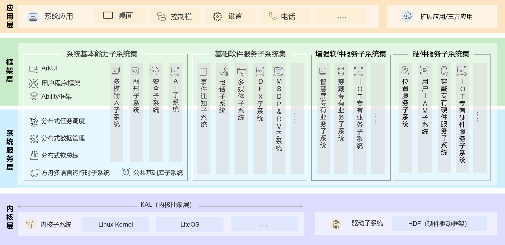

# OpenHarmony操作系统简介

> 说明： 您当前正在浏览OpenHarmony 3.2 Release版本的配套文档，请获取与该版本[配套的SDK](https://docs.openharmony.cn/pages/v3.2/zh-cn/release-notes/OpenHarmony-v3.2-release.md/#%E9%85%8D%E5%A5%97%E5%85%B3%E7%B3%BB)进行开发。

## 项目介绍
OpenHarmony是由开放原子开源基金会（OpenAtom Foundation）孵化及运营的开源项目，目标是面向全场景、全连接、全智能时代，基于开源的方式，搭建一个智能终端设备操作系统的框架和平台，促进万物互联产业的繁荣发展。

## 技术架构
OpenHarmony整体遵从分层设计，从下向上依次为：内核层、系统服务层、框架层和应用层。系统功能按照“系统 > 子系统 > 组件”逐级展开，在多设备部署场景下，支持根据实际需求裁剪某些非必要的组件。OpenHarmony技术架构如下所示：

### 内核层

- 内核子系统：采用多内核（Linux内核或者LiteOS）设计，支持针对不同资源受限设备选用适合的OS内核。内核抽象层（KAL，Kernel Abstract Layer）通过屏蔽多内核差异，对上层提供基础的内核能力，包括进程/线程管理、内存管理、文件系统、网络管理和外设管理等。

- 驱动子系统：驱动框架（HDF）是系统硬件生态开放的基础，提供统一外设访问能力和驱动开发、管理框架。

### 系统服务层

系统服务层是OpenHarmony的核心能力集合，通过框架层对应用程序提供服务。该层包含以下几个部分：

- 系统基本能力子系统集：为分布式应用在多设备上的运行、调度、迁移等操作提供了基础能力，由分布式软总线、分布式数据管理、分布式任务调度、公共基础库、多模输入、图形、安全、AI等子系统组成。

- 基础软件服务子系统集：提供公共的、通用的软件服务，由事件通知、电话、多媒体、DFX（Design For X） 等子系统组成。

- 增强软件服务子系统集：提供针对不同设备的、差异化的能力增强型软件服务，由智慧屏专有业务、穿戴专有业务、IoT专有业务等子系统组成。

- 硬件服务子系统集：提供硬件服务，由位置服务、用户IAM、穿戴专有硬件服务、IoT专有硬件服务等子系统组成。

根据不同设备形态的部署环境，基础软件服务子系统集、增强软件服务子系统集、硬件服务子系统集内部可以按子系统粒度裁剪，每个子系统内部又可以按功能粒度裁剪。

### 框架层

框架层为应用开发提供了C/C++/JS等多语言的用户程序框架和Ability框架，适用于JS语言的ArkUI框架，以及各种软硬件服务对外开放的多语言框架API。根据系统的组件化裁剪程度，设备支持的API也会有所不同。

### 应用层

应用层包括系统应用和第三方非系统应用。应用由一个或多个FA（Feature Ability）或PA（Particle Ability）组成。其中，FA有UI界面，提供与用户交互的能力；而PA无UI界面，提供后台运行任务的能力以及统一的数据访问抽象。基于FA/PA开发的应用，能够实现特定的业务功能，支持跨设备调度与分发，为用户提供一致、高效的应用体验。

## 技术特性
### 硬件互助，资源共享

主要通过下列模块达成

- 分布式软总线

分布式软总线是多设备终端的统一基座，为设备间的无缝互联提供了统一的分布式通信能力，能够快速发现并连接设备，高效地传输任务和数据。

- 分布式数据管理

分布式数据管理位于基于分布式软总线之上的能力，实现了应用程序数据和用户数据的分布式管理。用户数据不再与单一物理设备绑定，业务逻辑与数据存储分离，应用跨设备运行时数据无缝衔接，为打造一致、流畅的用户体验创造了基础条件

- 分布式任务调度

分布式任务调度基于分布式软总线、分布式数据管理、分布式Profile等技术特性，构建统一的分布式服务管理（发现、同步、注册、调用）机制，支持对跨设备的应用进行远程启动、远程调用、绑定/解绑、以及迁移等操作，能够根据不同设备的能力、位置、业务运行状态、资源使用情况并结合用户的习惯和意图，选择最合适的设备运行分布式任务

- 设备虚拟化

分布式设备虚拟化平台可以实现不同设备的资源融合、设备管理、数据处理，将周边设备作为手机能力的延伸，共同形成一个超级虚拟终端。

### 一次开发，多端部署

OpenHarmony提供用户程序框架、Ability框架以及UI框架，能够保证开发的应用在多终端运行时保证一致性。一次开发、多端部署。

多终端软件平台API具备一致性，确保用户程序的运行兼容性。

- 支持在开发过程中预览终端的能力适配情况（CPU/内存/外设/软件资源等）。
- 支持根据用户程序与软件平台的兼容性来调度用户呈现。
### 统一OS，弹性部署

OpenHarmony通过组件化和组件弹性化等设计方法，做到硬件资源的可大可小，在多种终端设备间，按需弹性部署，全面覆盖了ARM、RISC-V、x86等各种CPU，从百KiB到GiB级别的RAM。