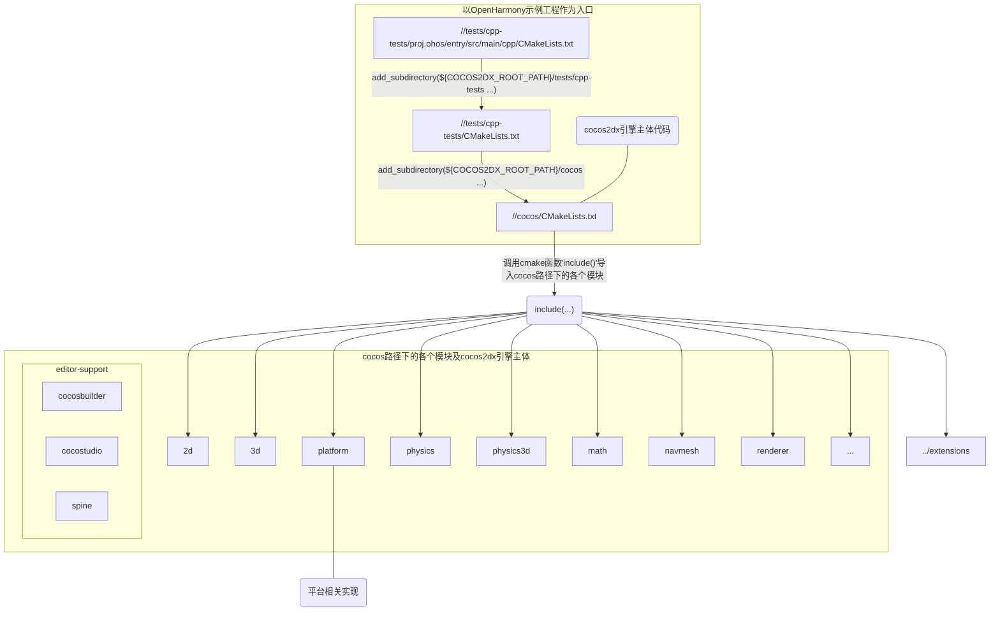
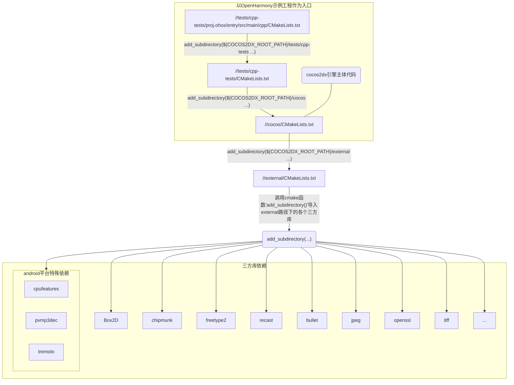
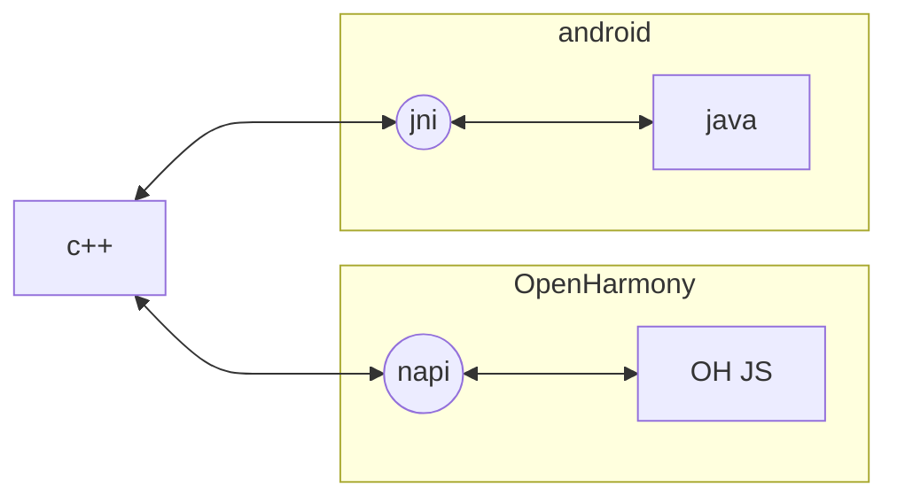

# 待移植工程依赖关系的识别
> 由于cocos2dx各个版本之间的代码结构、内容会有或多或少的不同，  </br>
> 本文档希望借助一个3.17.2版本的依赖关系识别方式介绍，达到作为其他cocos2dx版本工程依赖识别的参考。

## 目录
- [待移植工程依赖关系的识别](#待移植工程依赖关系的识别)
  - [目录](#目录)
  - [识别最小模块依赖](#识别最小模块依赖)
  - [识别最小三方库依赖](#识别最小三方库依赖)
  - [识别最小系统接口依赖](#识别最小系统接口依赖)
    - [通过`android`工程识别`OH`工程对系统接口的依赖方式](#通过android工程识别oh工程对系统接口的依赖方式)
    - [沟通`c++`层与`java`层——`jni`](#沟通c层与java层jni)
    - [`android`的开发套件——`ndk`](#android的开发套件ndk)


## 识别最小模块依赖

> 以CMakeLists.txt的编译依赖栈为线索，梳理最小模块依赖



## 识别最小三方库依赖

> 以CMakeLists.txt的编译依赖栈为线索，梳理最小三方库依赖



## 识别最小系统接口依赖

### 通过`android`工程识别`OH`工程对系统接口的依赖方式

1. `jni`与`napi`
    `android`工程代码主要使用`java`开发，而`cocos2dx`引擎的接口都是`c++`，`c++`层和`java`层之间就需要`jni`来相互调用。  
    而`OH`工程的代码主要使用`OH JS`，`c++`层和`OH JS`层之间就需要`jni`来相互调用。


2. `ndk`与`oh sdk`
    `android`工程代码会直接在`c++`代码中调用`ndk`提供的接口，
    比如`android/log.h`导入并使用了日志工具，这也需要使用`oh sdk`提供的接口进行替换。


### 沟通`c++`层与`java`层——`jni`
> jni有两个部分的内容，
> 实现在`c++`，调用在`java`；
> 实现在`java`，调用在`c++`。

- 实现在`c++`，调用在`java`
    所有这样的函数都需要在函数定义的地方插入`JNICALL`宏，可以通过全局搜索该宏找到它们
    ```shell
    # 为缩短文字篇幅，只展示部分搜索结果
        $ grep -rn JNICALL
        ...
        cocos/platform/android/jni/Java_org_cocos2dx_lib_Cocos2dxRenderer.cpp:41:    JNIEXPORT void JNICALL Java_org_cocos2dx_lib_Cocos2dxRenderer_nativeRender(JNIEnv* env) {
        cocos/platform/android/jni/Java_org_cocos2dx_lib_Cocos2dxRenderer.cpp:45:    JNIEXPORT void JNICALL Java_org_cocos2dx_lib_Cocos2dxRenderer_nativeOnPause() {
        cocos/platform/android/jni/Java_org_cocos2dx_lib_Cocos2dxRenderer.cpp:53:    JNIEXPORT void JNICALL Java_org_cocos2dx_lib_Cocos2dxRenderer_nativeOnResume() {
        cocos/platform/android/jni/Java_org_cocos2dx_lib_Cocos2dxRenderer.cpp:68:    JNIEXPORT void JNICALL Java_org_cocos2dx_lib_Cocos2dxRenderer_nativeInsertText(JNIEnv* env, jobject thiz, jstring text) {
        ...
    ```

- 实现在`java`，调用在`c++`
    在`//cocos/platform/android/jni/JniHelper.h`中提供了9个调用`java`方法的`c++`函数
    - `static void callStaticVoidMethod(...)`
    - `static bool callStaticBooleanMethod(...)`
    - `static int callStaticIntMethod(...)`
    - `static float callStaticFloatMethod(...)`
    - `static float* callStaticFloatArrayMethod(...)`
    - `static int* callStaticIntArrayMethod(...)`
    - `static Vec3 callStaticVec3Method(...)`
    - `static double callStaticDoubleMethod(...)`
    - `static std::string callStaticStringMethod(...)`

    可以通过全局搜索这些函数名找到它们
    ```shell
    # 为缩短文字篇幅，只展示部分搜索结果
        $ grep -E -rn "callStatic.*?Method"
        ...
        cocos/audio/android/jni/cddandroidAndroidJavaEngine.cpp:286:        JniHelper::callStaticVoidMethod(helperClassName, "unloadEffect", fullPath);
        cocos/audio/android/utils/Utils.cpp:32:    return JniHelper::callStaticIntMethod("org.cocos2dx.lib.Cocos2dxHelper", "getSDKVersion");
        cocos/base/CCController-android.cpp:160:    JniHelper::callStaticVoidMethod("org.cocos2dx.lib.GameControllerHelper", "receiveExternalKeyEvent", _deviceId, externalKeyCode, receive);
        ...
    ```

### `android`的开发套件——`ndk`

对`ndk`依赖的识别从`c++`代码中的头文件导入入手，全局搜索对`ndk`头文件的`#include ...`，拿带`android`路径的头文件举例：
```
# 为缩短文字篇幅，只展示部分搜索结果
    $ grep --color=auto -E -rn "#include.*android"
    ...
    # ndk提供的日志工具
    cocos/platform/android/CCApplication-android.cpp:34:#include <android/log.h>
    ...
    # ndk提供的文件工具
    cocos/platform/android/CCFileUtils-android.cpp:34:#include "android/asset_manager.h"
    ...
```

