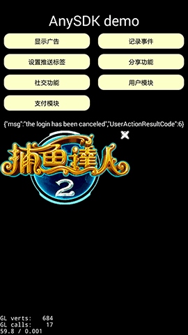

编译 Android 工程
================

要编译 Android 功能，必须使用最新版本的 Android SDK 和`指定的 r9d 版本` Android NDK。


## 安装 Android SDK 和 NDK

不管是 Mac 还是 Windows 环境，都需要从 [http://developer.android.com/sdk/](http://developer.android.com/sdk/) 下载最新版本的 ADT Bundle。

下载解压缩以后，运行 `sdk/tools` 目录中的 `android` 工具，对 SDK 进行更新。

> 由于网络问题，大家需要代理才能完成更新操作。

由于 cocos2d-x 还不支持最新的 NDK r10，所以我们需要从网络上搜索 NDK r9d 用于编译。

> SDK 和 NDK 不能放在包含中文和空格的目录中。
> Windows 下，SDK/NDK 必须和 quick 的文件放在同一个分区中。

在完成 SDK 和 NDK 的下载安装后，我们需要做一些环境配置工作：

-   Mac 下修改 .profile 文件：

    启动 终端 应用程序, 运行命令:

    ~~~
    $ if [ -f ~/.profile ]; then open -e ~/.profile; fi
    ~~~

    如果没看到文本编辑窗口出现，则运行以下命令：

    ~~~
    $ if [ -f ~/.bash_profile ]; then open -e ~/.bash_profile; fi
    ~~~

    添加以下代码：

    ~~~
    export ANDROID_NDK_ROOT=NDK绝对路径
    export ANDROID_SDK_ROOT=SDK绝对路径
    export ANDROID_HOME=${ANDROID_SDK_ROOT}
    ~~~

    例如：

    ~~~
    export ANDROID_NDK_ROOT=/Users/dualface/android-ndk-r9d
    export ANDROID_SDK_ROOT=/Users/dualface/android-sdk
    export ANDROID_HOME=${ANDROID_SDK_ROOT}
    ~~~

-   Windows 下在系统设置里添加以下环境变量：

    ~~~
    ANDROID_NDK_ROOT=NDK绝对路径
    ANDROID_SDK_ROOT=SDK绝对路径
    ANDROID_HOME=%ANDROID_SDK_ROOT%
    ~~~

    例如：

    ~~~
    ANDROID_NDK_ROOT=C:\Work\android-ndk-r9d
    ANDROID_SDK_ROOT=C:\Work\android-sdk
    ANDROID_HOME=%ANDROID_SDK_ROOT%
    ~~~


## 编译 samples/anysdk

quick 中带有一个 AnySDK 的示例，我们可以编译这个示例来检查准备工作是否就绪：

> AnySDK 是一个极为方便的工具，可以大大减低接入 SDK 的工作量。
> 
> 详情请访问：[http://www.anysdk.com/](http://www.anysdk.com/)
> 
> AnySDK 为 CP 商提供一套第三方SDK接入解决方案，整个接入过程，不改变任何 SDK 的功能、特性、参数等，对于最终玩家而言是完全透明无感知的。目的是让 CP 商能有更多时间更专注于游戏本身的品质，所有 SDK 的接入工作统统交给我们吧。第三方 SDK 包括了渠道 SDK、用户系统、支付系统、广告系统、统计系统、分享系统等等。我们不开 SDK，我们只帮您轻松接入第三方 SDK！

1.  新建一个工程,把 AnySDK 示例中的src,res文件夹覆盖对应文件夹
2.  打开终端窗口，进入新工程的 `frameworks/runtime-src/proj.android` 目录
3.  如果是 Mac 系统，运行 `./build_native.sh`，Windows 系统则运行 `build_native.bat`
4.  如果一切顺利，我们将看到输出信息的最后几行：

    ~~~
    SharedLibrary  : libgame.so
    Install        : libgame.so => libs/armeabi/libgame.so
    ~~~

注意:

1.  `proj.android` 包含了anysdk,需要用anysdk来集成第三方sdk的推荐用这个工程, `proj.android_no_anysdk` 不包含anysdk
2.  `build_native.sh` 编译的是debug版本, `build_native_release.sh` 编译的是release版本


如果编译失败，请仔细检查 SDK/NDK 版本、安装路径。

> 修改了环境设置后，必须重新打开终端窗口才能生效。


运行 `build_native` 只是编译了 C++ 部分，而 Android 应用还存在 Java 部分，这时就需要 Eclipse ADT 来进行了。

### 将项目导入 Eclipse ADT

在先前下载的 `ADT Bundle` 中，已经包含了 Eclipse ADT 工具。只需要从 `eclipse` 目录中启动即可。下面的截图是 Mac 系统，但 Windows 系统中的操作完全一致。

启动后，需要先导入 cocos2d-x 的 Java 库：

1.  选择菜单 File -> Import, 再选择 Android -> Existing Android Code Into Workspace
2.  点击 Browse 按钮, 选择新工程目录中的 `frameworks/cocos2d-x/cocos/platform/android/java`
3.  点击 "Finish" 完成操作。

接下来导入 AnySDK 示例的 Android 工程：

1.  重复上述步骤，导入 `frameworks/runtime-src/proj.android`
2.  在 `AnySDK` 工程上点击右键选择菜单 "Properties" 打开工程设置对话框
3.  从左侧选择 `Android`，然后点击右侧 "Add" 按钮，添加 `v3quick` 库。如果添加之前 `v3quick` 库已经在 `Library` 列表中，则删除后重新添加
4.  检查 `Project Build Target` 是否是最新版本的 SDK

    


如果完成上述操作后，Eclipse ADT 窗口 `Package Explorer` 列出的 `v3quick` 和 `AnySDK` 项目文件夹上有红色错误图标。请仔细检查 `v3quick` 和 `AnySDK` 项目的操作步骤，以及 `Project Build Target` 是否是最新版本的 SDK。


### 设置 Android 设备允许真机调试 ###

Android 官方文档：http://developer.android.com/tools/device.html

1.  Enable USB debugging on your device.

    -   On most devices running Android 3.2 or older, you can find the option under Settings > Applications > Development.
    -   On Android 4.0 and newer, it’s in Settings > Developer options.

        Note: On Android 4.2 and newer, Developer options is hidden by default. To make it available, go to Settings > About phone and tap Build number seven times. Return to the previous screen to find Developer options.
    
    -   在系统设置中找到“开发者选项”，打开“USB调试”。Android 4.2 开始，`开发者选项`默认是隐藏的，需要打开`设置->关于`界面，然后在`Build Number`上点击七次才能打开`开发者选项`。

2.  Set up your system to detect your device.

    -   If you’re developing on Windows, you need to install a USB driver for adb. For an installation guide and links to OEM drivers, see the OEM USB Drivers document.

    -   根据不同的机型，也许需要安装该机型特定的 USB 驱动程序。例如 Moto 就必须安装 Moto 的 USB 驱动。

3.  Connect your device.
    
    完成设置后，将设备连接到开发机，并解锁设备。


### 在设备上测试 AnySDK 示例 ###

1.  在 Eclipse ADT 里选择菜单 Window -> Show View -> Other…, 再选择 Android -> Devices

2.  如果设备设置完成，那么在 Devices 标签页中就可以看到你的设备

3.  在 `AnySDK` 项目上点击鼠标右键, 选择菜单 Debug As -> Android Application. 如果一切正常，等一会儿就可以在设备上看到运行画面了：

    


## 使用 build_apk 脚本快速生成 apk

> 首先确保已经能够正常编译 Android 项目。

如果是 Windows 系统，还需要添加 `JAVA_HOME` 环境变量，指向 JDK 所在目录。并且将 JDK 的 `bin` 目录路径加入 `PATH` 环境变量。

如果环境未搭建好或者未配置好，运行时会在命令行报相关错误提示并返回非 0 的错误码。


### 运行 build_apk

在终端窗口中，进入工程的 proj.android 目录，然后运行 build_apk 脚本。

-   如果执行成功，将生成 `proj.android/<项目名-日期-时间>.apk` 文件，并返回 0 值。
-   如果执行失败，将显示错误信息，并返回非 0 错误代码。


build_apk 支持下列参数：

-   -classpath <路径>

    指定查找用户类文件的位置。

    如果有额外的第三方 jar 包需要集成可能会需要添加此参数。默认情况下不需要指定此参数。

-   -jv <版本号>
    
    指定要使用的 JDK 版本号。默认参数为1.6。

    如果使用其他版本的 JDK，可能需要指定此参数与要使用的 JDK 版本相一致。

-   -api <版本号>

    指定要使用的 Android 的 api 版本号。默认参数为19，即使用 android-19。

-   -bt <版本号>

    指定要使用的 ADT 的 build tools的版本号

    一般不需要指定此参数，脚本运行时会自动到 ANDROID_SDK_ROOT/build-tools 目录下查找可用的版本。如果此目录下有多个版本，例如有 android-4.4.2 和 android-4.3 ，则可以通过 `-bt 4.4.2` 来强制指定其中的 4.4.2 版本，但即使不指定也会找到其中一个来使用。

-   -k <文件路径> -kp <口令> -ksa <密钥库名称>

    三个参数分别指定：要用于签名的密匙库文件，密钥库口令和密匙库名称。

    例如 -k mycert.keystore -kp 123456 -ksa mycert

-   -nosign

    不对 apk 进行签名。

    指定这个参数后，输出的 apk 文件名是 `proj.android/<项目名-日期-时间>-unsigned.apk` 。
   
-  -bldm release

   编译relase版本, 要debug版不要加此参数


### 注意事项

-   JDK 1.7以上的版本，在指定相关参数后可以打包成功，但打包出来的apk在真机可能无法安装和运行，请尽量使用 JDK 1.6版本。
-   旧版本 ADT 的目录结构不同，有可能造成无法找到 build tools 等，造成打包失败。

~

## 使用模块化编译缩小 apk 体积

在 quick 中可以使用模块化编译功能，按照项目需求编译出更小的可执行文件。

要启用这个功能，开发者需要打开项目中的 `proj.android/jni/Application.mk` 文件，然后将不需要的模块值改为 `0`。

| MACRO                  |  体积  | 功能  |
|------------------------|--------|----------|
|CC_USE_CURL             |  1.3M  | 使用 CURL 库提供 HTTP 网络功能。关闭后，assetsmanager等相关功能也会被去掉。quick 在 Android 下使用 Android 系统的 Java 接口提供 HTTP 网络功能，所以 CURL 关闭后仍然可以使用HttpRequest。 |
|CC_USE_TIFF             |  514KB | 使用 TIFF 图像格式。 |
|CC_USE_WEBP             |  208KB | 使用 WebP 图像格式。 |
|CC_USE_JPEG             |  368KB | 使用 JPEG 图像格式。 |
|CC_USE_PHYSICS          |  416KB | 使用物理引擎。 |
|CC_USE_3D               |  212KB | 使用 3D 模块。 |
|CC_USE_SQLITE           |  367KB | 使用 Lua 的 Sqlite 数据库扩展 lsqlite3。 |
|CC_USE_CCSTUDIO         |  1.2M  | 使用 Cocos Studio 支持模块。 |
|CC_USE_CCBUILDER        |  208KB | 使用 Cocos Builder 支持模块。 |
|CC_USE_SPINE            |   92KB | 使用 Spine 支持模块。 |
|CC_CODE_IDE_DEBUG_SUPPORT|       | 使用 cocos IDE 调试支持模块。在 release 版本里自动关闭，因此没有统计它在release版本下的体积。 |


只需要在 `Applicaiton.mk` 中将相应的宏设置为 `0`，然后重新编译就可以得到更小的可执行文件。

> 在proj.android_no_anysdk工程中，以上可选模块均已经关闭。因此如果直接使用no_anysdk工程来编译，生成的apk包将不支持上述模块功能，如需要请自己修改相应的开关。

还有一些常用的基础模块可以去除，由于可能影响常用的功能，请根据自己的情况移除。打开文件 frameworks/runtime-src/Classes/lua_module_register.h ，分别注释掉以下语句：


```C++

    register_cocosdenshion_module(L);   // 简单音效模块
    register_network_module(L);         // 网络模块，如 socket 和 websocket
    register_ui_moudle(L);              // 基础UI库，如编辑框等
    register_extension_module(L);       // 基本扩展，如 TableView 等
    register_audioengine_module(L);     // audio engine 模块

```


