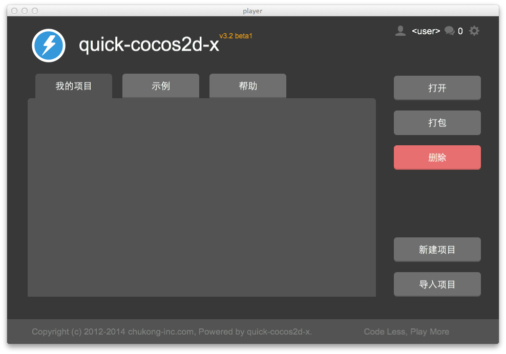
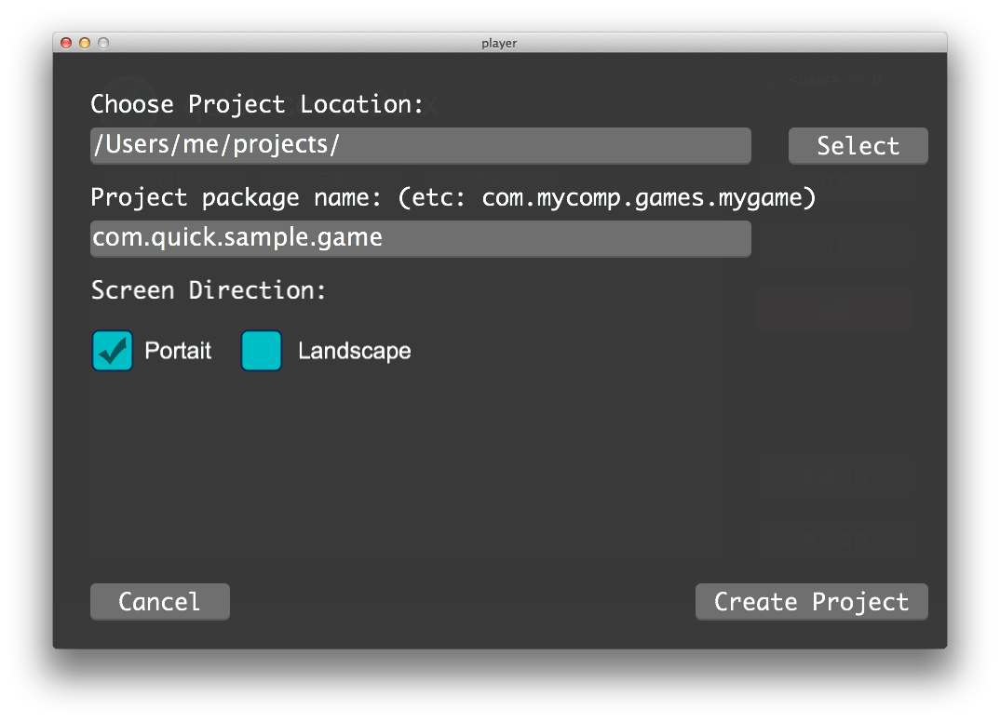
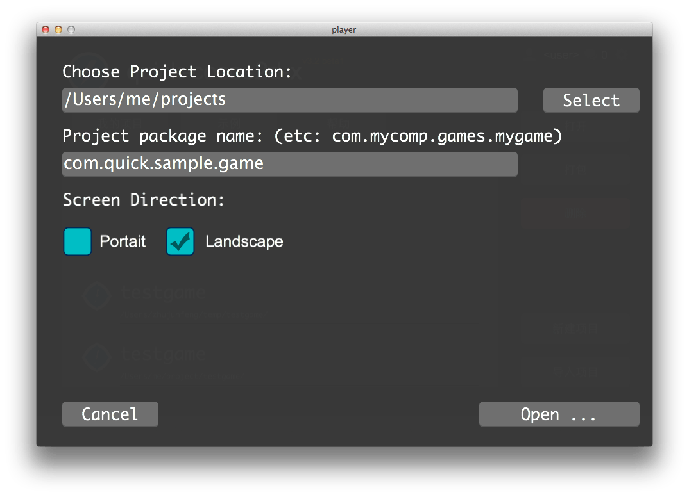
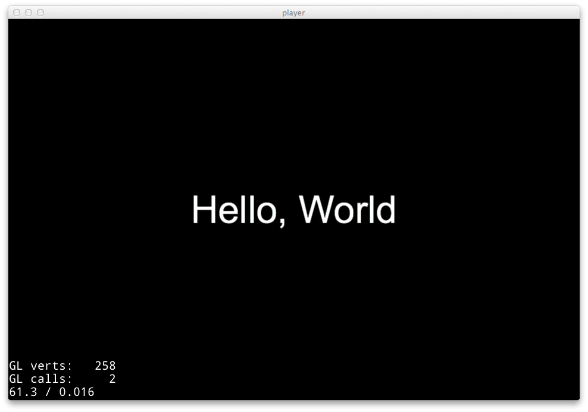

Title: player 使用说明

player 使用说明
=============

## 环境设置

player 依赖一些特定的环境设置才能正常工作，所以如果你不确定你的环境设置是否正常，可以按照以下步骤操作：

-   Mac 平台下运行 setup_mac.sh
-   Windows 平台下运行 setup_win.bat

设置完成后重新启动 player 即可。

## 启动 player

启动 player 后将看到以下画面：

### 运行示例

在 player 主界面上点击“示例”页，上下滚动查看示例列表，选择需要的示例来运行吧。

### 创建项目

在 player 界面上点选“新建项目”：

选择项目存放目录，输入项目的包名，选择屏幕方向，点击“Create Project”创建一个新项目。

创建完成后，右下角按钮变成“Open ...”，点击可以打开自己的项目了！

### 导入和运行项目

你可以用player来运行自己新建的项目。选择“导入项目”：

选“Open Project”就可以运行自己的项目了。

下一次你进入player时，“我的项目”里会列出你运行过的项目，因此你不需要再重新导入，只需要选中项目，点击“打开”即可运行。

