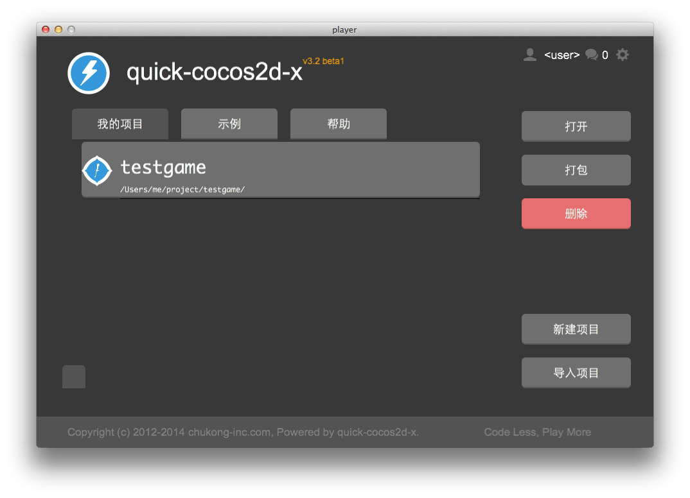

player 使用说明
=============

## 环境设置

player 依赖一些特定的环境设置才能正常工作，所以如果你不确定你的环境设置是否正常，可以按照以下步骤操作：

-   Mac 平台下运行 setup_mac.sh
-   Windows 平台下运行 setup_win.bat

设置完成后重新启动 player 即可。

## 启动 player

启动 player 后将看到以下画面(第一次进入或者 `我的项目` 没有项目,会跳转到示例界面)：

### 运行示例

在 player 主界面上点击“示例”页，上下滚动查看示例列表，选择需要的示例来运行吧。

### 创建项目

创建项目,有两种方式:

- 命令行创建
- 通过 `Player` 创建

[创建工程的两种方式](../create-project/zh.md)

在 player 界面上点选“新建项目”, 设置好要放置的目录,包名,屏幕方向,点击 `Create Project`, 会弹出一个命令行窗口自动创建

> 一定要等命令行的窗口,创建工程成功,再点击 `Open ...` 打开工程

### 导入和运行项目

你可以用 player 来运行自己的quick项目。选择“导入项目”：

选“Open Project”就可以运行自己的项目了。

下一次你进入player时，“我的项目”里会列出你运行过的项目，因此你不需要再重新导入，只需要选中项目，点击“打开”即可运行。

### 编译项目

1. 点击 `编译` 按钮
2. 根据需要选择对应的参数

编译方式:

- `BuildNative` 编译so文件
- `BuildAPK` 编译好so后,再打包apk文件

编译参数对 `BuildAPK` 命令的各种参数

`Clear` 按钮可以清上一次的编译记录,需要重新编译,建议先执行下这一步
`Compile` 按钮 开始执行编译命令

> `Player` 中的编默认,你已配好Android NDK,Java相关的环境变量

### 更详细的编译说明

[命令行的编译方式](../compile-android/zh.md)
