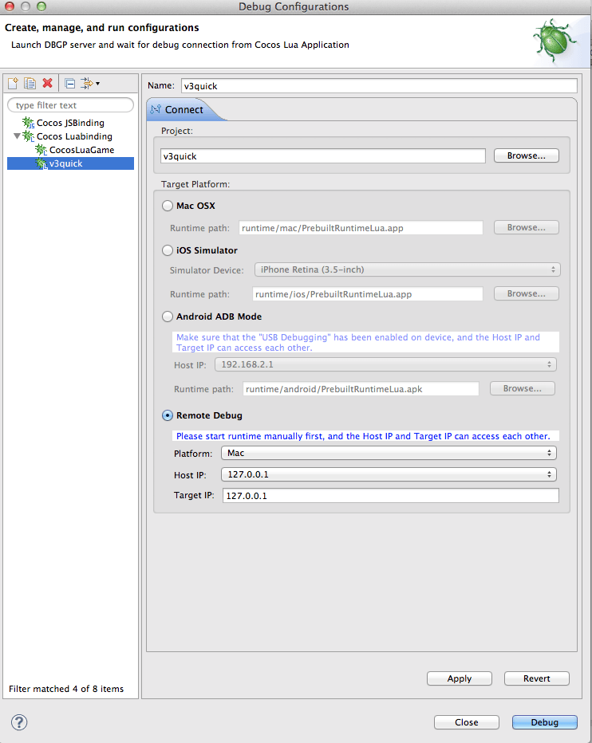
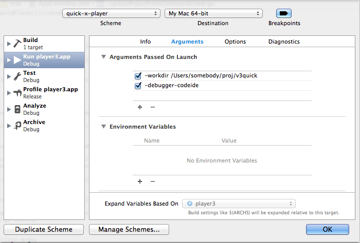

Title: 在 Code IDE 中调试 quick 工程

在 Code IDE 中调试 quick 工程
===========================

> Code IDE 是 cocos2d-x 团队为开发者提供的全功能代码开发环境。

注意：新版本的 Code IDE 已经能很好的支持 quick 3.3rc1 以上版本的工程，不需要特殊的设置。以下的说明只适用于 Code IDE 1.0 rc1 和 1.0.1 之间的版本。

~

## 准备

1.  在 Code IDE 中导入 quick 工程：

    启动 Code IDE 后，选择菜单 File -> Import -> Cocos -> Import Cocos Project，并选择 quick 工程所在目录。

2.  设置调试参数

    在 Code IDE 的 Lua Projects Explorer 界面里，选中要调试的项目。然后选择菜单 Run -> Debug Configurations，打开设置界面。

    1.  在设置界面左侧的 Cocos Luabinding 组下面新建一个配置项
    2.  选择 Target Platform 为 Remote Debug，并设置 Platform 为 Mac 或 Windows
    3.  Host IP 和 Target IP 均设置为 127.0.0.1
    4.  点击 "Apply" 按钮保存设置。

    

~

## 从命令行启动 player 进行调试（仅能调试 Lua 代码）

目前版本（quick 3.2rc1）中，只能从命令行启动 player 的调试功能：

-   在命令行窗口中进入要调试的项目所在目录
-   Mac 环境执行 debug_mac.sh，Windows 环境执行 debug_win.bat
-   player 将启动，并等待调试器连接
-   在 Code IDE 中，设置好 Lua 代码断点
-   点击 Code IDE 工具栏中的 Debug Remote 按钮开始调试

~

## 配合 Xcode 和 Code IDE 进行 C++ 和 Lua 联调

如果要联调 C++ 和 Lua 代码，那么必须打开 player 的 Mac 工程进行调试：

-   用 Xcode 打开 quick/player/proj.mac/player3.xcodeproj 工程
-   选择菜单 Product -> Scheme -> player3
-   选择菜单 Product -> Scheme -> Edit Scheme，打开 Scheme 对话框
-   从对话框左侧选中 Run，右侧选中 Arguments，然后点击 Arguments Passed On Launch 下的 `+` 按钮，输入以下调试参数：

~~~

-debugger-codeide
-workdir "工程绝对路径"
-size 960x640

~~~

-   如果是竖屏， 修改 -size 参数为 640x960 或需要的值即可。

    

-   设置完成后用 Xcode 运行 player 项目
-   在 player 启动后切换到 Code IDE 设置断点再开启 Debug Remote
-   在调试期间，如果遇到 Lua 代码中设置的断点，则切换到 Code IDE 查看断点情况
-   如果遇到 C++ 断点，则切换到 Xcode 查看断点情况

~

## 配合 Visual Studio 和 Code IDE 进行 C++ 和 Lua 联调

-   用 Visual Studio 打开 quick\\player\\proj.win32\\player3.sln 工程
-   选择 player3 项目
-   选择菜单 Project -> Properties，打开 Project Property 对话框
-   从对话框左侧选中 Configuration Properties / Debugging
-   从右侧选中 Command Arguments，并添加命令参数内容

    

-   设置完成后和 Xcode 一样开启调试即可。

## 已知问题

-	目前code IDE还不支持挂在cc下面的外部模块提示,所以quick中framework/cc/下面的都还无法提示

