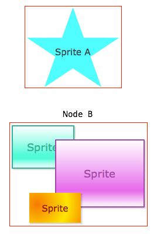

quick 中的触摸事件
================

cocos2d-x 原本的触摸机制存在一些限制，在使用中需要开发者做不少额外的处理。所以 quick-cocos2d-x 提出了自己的一套触摸机制。本文详细介绍了这套新机制的用法。

## 显示层级

在 cocos2d-x 里，整个游戏的画面是由一系列的 Scene, Node, Sprite, Layer 等对象构成的。而所有这些对象都是从 Node 这个类继承而来。我们可以将 Node 称为`显示节点`。

一个游戏画面就是许多显示节点构成的一棵树：

~~~

/|\
 | 显示层级
 |
 |         [Node]  [Node]  [Node]
 |           |       |       |
 |           +---+---+       |
 |               |           |
 |             [Node]      [Node]
 |               |           |
 |               +-----+-----+
 |                     |
 |                   [Node]

~~~

在这棵树里，Node 所处的垂直位置就是它们的`显示层级`。越往上的 Node，其显示层级就越高。从画面表现上来说，下面的 Node 是背景，上面的 Node 是建筑，那么建筑就会挡住一部分背景。

## 触摸区域

在 cocos2d-x 里，只有 Layer 对象才能接受触摸事件。而 Layer 总是响应整个屏幕范围内的触摸，这就要求开发者在拿到触摸事件后，再做进一步的处理。

例如有一个需求是在玩家触摸屏幕上的方块时，人物角色做一个动作。那么使用 Layer 接受到触摸事件后，开发者需要自行判断触摸位置是否在方块之内。当屏幕上有很多东西需要响应玩家交互时，程序结构就开始变得复杂了。

所以 quick-cocos2d-x 允许开发者将任何一个 Node 设置为接受触摸事件。并且触摸事件一开始只会出现在这个 Node 的`触摸区域`内。

所谓`触摸区域`，就是一个 Node 及其所有子 Node 显示内容占据的屏幕空间。要注意的是这个屏幕空间包含了图片的透明部分。下图中，节点 A 是一个 Sprite 对象，它的触摸区域就是图片大小；而节点 B 是一个 Node 对象，其中包含了三个 Sprite 对象，那么节点 B 的触摸区域就是三个 Sprite 对象触摸区域的合集。

为了简化实现，`触摸区域`都是一个矩形，所以节点 B 的`触摸区域`实际上是一个“包含三个 Sprite 对象触摸区域合集的矩形”，可以参考上图中的红色边框线。

## 用法示例

下面列出触摸事件的用法示例，更详细的示例请参考 `samples/touch` 示例。

### 单点触摸事件

~~~lua
-- 允许 node 接受触摸事件
node:setTouchEnabled(true)

-- 注册触摸事件
node:addNodeEventListener(cc.NODE_TOUCH_EVENT, function(event)
    -- event.name 是触摸事件的状态：began, moved, ended, cancelled
    -- event.x, event.y 是触摸点当前位置
    -- event.prevX, event.prevY 是触摸点之前的位置
    printf("sprite: %s x,y: %0.2f, %0.2f",
           event.name, event.x, event.y)

    -- 在 began 状态时，如果要让 Node 继续接收该触摸事件的状态变化
    -- 则必须返回 true
    if event.name == "began" then
        return true
    end
end)
~~~

触摸事件的 `event.name` 指示了事件的状态：

-   **began**: 手指开始触摸屏幕。在 `began` 状态时，如果要继续接收该触摸事件的状态变化，事件处理函数必须返回 `true`。
-   **moved**: 手指在屏幕上移动。
-   **ended**: 手指离开屏幕。
-   **cancelled**: 因为其他原因取消触摸操作。

### 多点触摸

~~~lua
-- 允许 node 接受触摸事件
node:setTouchEnabled(true)

-- 设置触摸模式
node:setTouchMode(cc.TOUCH_MODE_ALL_AT_ONCE) -- 多点
-- node:setTouchMode(cc.TOUCH_MODE_ONE_BY_ONE) -- 单点（默认模式）

-- 注册触摸事件
node:addNodeEventListener(cc.NODE_TOUCH_EVENT, function(event)
    -- event.name 是触摸事件的状态：began, moved, ended, cancelled
    -- 多点触摸增加了 added 和 removed 状态
    -- event.points 包含所有触摸点
    -- 按照 events.point[id] = {x = ?, y = ?} 的结构组织
    for id, point in pairs(event.points) do
        printf("event [%s] %s = %0.2f, %0.2f",
               event.name, id, point.x, point.y)
    end

    if event.name == "began" then
        return true
    end
end)
~~~

在多点触摸时，事件状态的含义有所区别：

-   **began**: 手指开始触摸屏幕。用户可能同时用多个手指接触屏幕，但因为硬件响应速度极快的原因，`began` 状态时，`event.points` 中可能仍然只有一个触摸点的数据，其他触摸点数据会通过 `added` 状态提供。
-   **added**: 开始触摸后，如果有更多触摸点出现，则出现 `added` 状态。此时 `event.points` 中包含新加入的触摸点数据。
-   **removed**: 如果触摸结束前有触摸点消失（接触屏幕的部分手指离开了屏幕），则出现 `removed` 状态。此时 `event.points` 中包含删除的触摸点数据。
-   **ended**: 如果所有触摸点都消失（所有手指都离开了屏幕），则出现 `ended` 状态。此时 `event.points` 中包含删除的触摸点数据。
-   **moved**: 由于多点触摸时，可能只有部分触摸点移动。所以此时 `event.points` 中只包含有变化的触摸点数据。

## 触摸事件吞噬

默认情况下，Node 在响应触摸后（在 `began` 状态返回 `true` 表示要响应触摸），就会阻止事件继续传递给 Node 的父对象（更下层的 Node），这称为`触摸事件吞噬`。

如果要改变这个行为，可以用：

-   **setTouchSwallowEnabled()** 是否允许 Node 吞噬触摸，默认为 `true`。如果设置为 `false`，则 Node 响应触摸事件后，仍然会将事件继续传递给父对象。
-   **isTouchSwallowEnabled()** 检查 Node 是否允许吞噬触摸。

## 禁用触摸

对于一个 Node，随时可以启用或禁用其触摸事件：

-   **setTouchEnabled()** 是否允许 Node 响应触摸，默认为 `false`。
-   **isTouchEnabled()** 检查 Node 是否允许触摸。

但即便禁用了 Node 的触摸事件，也只能阻止这个 Node 响应触摸，而不能阻止这个 Node 的子 Node 响应触摸。

假设有一个对话框（Node），我们需要禁止对话框中的所有 Node 响应触摸。那么需要禁止对话框 Node 捕获事件：

~~~lua
dialog:setTouchCaptureEnabled(false)
~~~

-   **setTouchCaptureEnabled()** 是否允许 Node 捕获触摸，默认为 `true`。当设置为 `false` 时，该 Node 及其所有子 Node 都无法得到触摸事件。
-   **isTouchCaptureEnabled()** 检查 Node 是否允许捕获触摸。

总结而言，`setTouchEnabled()` 只针对当前 Node，而 `setTouchCaptureEnabled()` 同时影响当前 Node 及其所有子 Node。

## 触摸事件的三个阶段

quick 中触摸事件分为三个阶段：capturing（捕获）、targeting（触发）、bubbling（冒泡）。

当用户的一根手指触摸到屏幕时，将产生一个触摸事件：

1.  遍历所有响应触摸的 Node，找出`显示层级`最高，并且其`触摸区域`包含触摸位置的那个 Node。这个 Node 被称为 TargetNode（目标 Node）。
2.  检查 TargetNode 的 `isTouchCaptureEnabled()` 结果，如果返回 `false`，则重复 1
    1.  从 TargetNode 的根 Node（通常是 Scene）开始，检查 `cc.NODE_TOUCH_CAPTURE_EVENT` 事件的返回结果。任何一个 Node 返回 `false` 都会阻止事件在 TargetNode 上触发。并从步骤 1 开始查找其他符合条件的 Node。
    2.  这个阶段被称为 `capturing`。
3.  在 TargetNode 上触发事件。这个阶段被称为 `targeting`。
4.  如果事件返回结果为 `false`，表示 TargetNode 不响应该事件，并从步骤 1 开始查找其他符合条件的 Node。
5.  在 TargetNode 完成事件的响应后，检查 `TargetNode:isTouchSwallowEnabled()` 的返回值。如果是 `true`，则取消 `bubbling` 阶段。
6.  从 TargetNode 开始往其所有父 Node 触发事件，直到某个 Node 返回 `false` 或者事件被吞噬。这个阶段称为 `bubbling`。

利用事件的三个阶段，我们可以注册 `capturing` 阶段的触摸事件处理函数：

~~~lua
-- 在 capturing 阶段就捕获事件
node:addNodeEventListener(cc.NODE_TOUCH_CAPTURE_EVENT, function(event)
    if event.name == "began" then
        -- 在 began 状态返回 false，将阻止事件
        return false
    end
end)
~~~

关于触摸机制的灵活运用，可以参考 `cc.ui` 中的各个 UI 控件，以及 `samples/touch` 示例。

## API 参考

-   **addNodeEventListener()** 为 Node 的特定事件设置处理函数，返回一个 id 表示注册成功。
-   **removeNodeEventListener()** 从 Node 上移除指定类型的事件处理函数，需要提供 `addNodeEventListener()` 返回的注册 id。
-   **setTouchEnabled()** 是否允许 Node 响应触摸，默认为 `false`。
-   **isTouchEnabled()** 检查 Node 是否允许触摸。
-   **setTouchMode()** 设置触摸模式，默认为 `cc.TOUCH_MODE_ONE_BY_ONE`。
-   **getTouchMode()** 返回 Node 当前的触摸模式。
-   **setTouchCaptureEnabled()** 是否允许 Node 捕获触摸，默认为 `true`。
-   **isTouchCaptureEnabled()** 检查 Node 是否允许捕获触摸。
-   **setTouchSwallowEnabled()** 是否允许 Node 吞噬触摸，默认为 `true`。
-   **isTouchSwallowEnabled()** 检查 Node 是否允许吞噬触摸。

